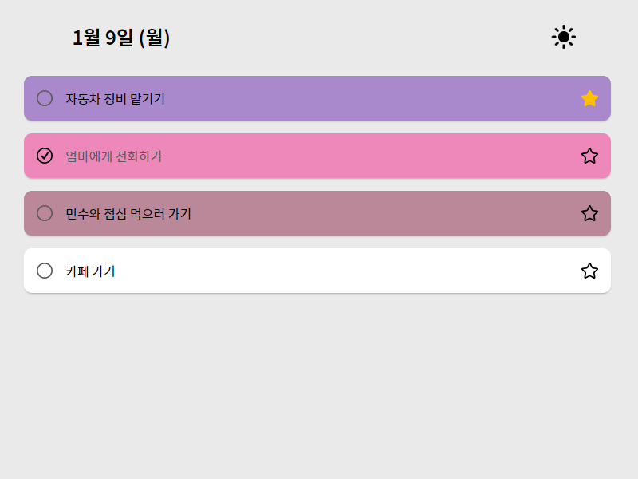
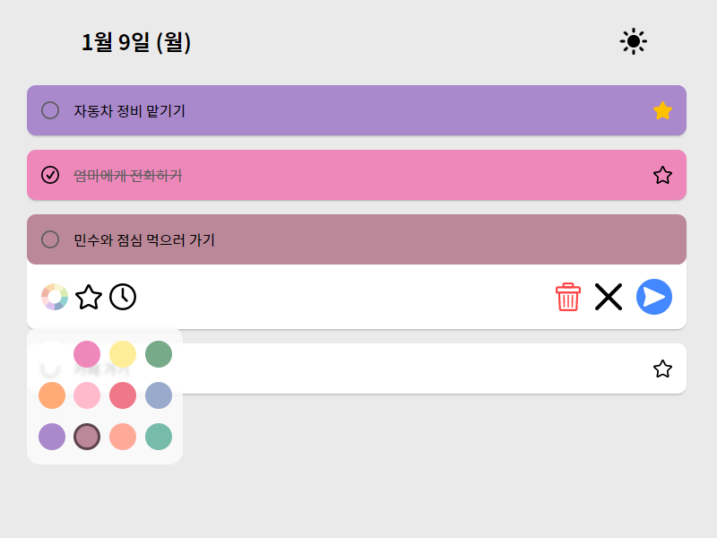
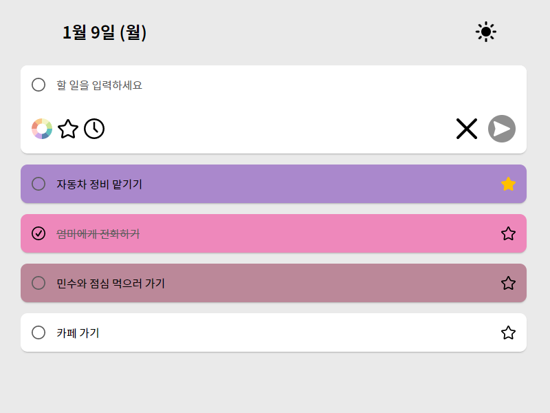
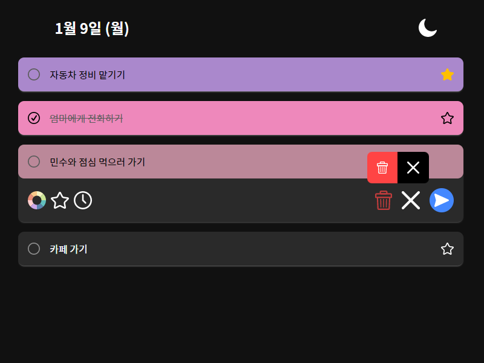

# todolist with 12 colors

심플하고 아름다운 투두 리스트로 생산성을 높이세요.

## 구현한 기능

- 현재 날짜 출력 (1분마다 실시간 업데이트)
   
- 완료된 목록, 즐겨찾기 목록 관리 가능
  
   
- 12가지 색상으로 알록달록 목록 꾸미기
  
   
- 목록 생성, 수정, 삭제 기능
  
   
- 다크 모드 토글 지원
  
   
- 반응형 완벽 지원
   

## fix 필요

- 추가 기능 개선: 추가 버튼 토글화(ex아래쪽버튼으로 끄기) xx
- 리스트 overflow 개선 -> DONE
- 리스트 색상 재정의 - DONE
- 삭제시 확인 알림 -> DONE
- 팝업메뉴 아래로 가있으면 위로 올리기(컬러피커, 삭제알림 등)
- 반응형 개선

## 구현할 기능

- 다크 모드 : OS 설정값 자동 인식, 토글 버튼 有
- !!알림 기능!! : 브라우저 자체 알림기능 이용
- 순서 변경 기능 : 드래그 앤 드롭 -> ㅅㅂ..
- 정렬 알고리즘 개선 : 즐겨찾기 우선, 즐겨찾기 하는 순간 인덱스 위로 올라감 -> DONE
- 브라우저 스토리지 : 로컬스토리지, 저장된 리스트 목록, 다크모드 유저세팅 여부
- 단축키 : 엔터(저장), esc(취소)

## 구현할 수도 있는 기능

- 다른 날에 추가하기 (달력 기능 포함)
- db 구축해서 정식 서비스 가능할 정도까지 만들기..
